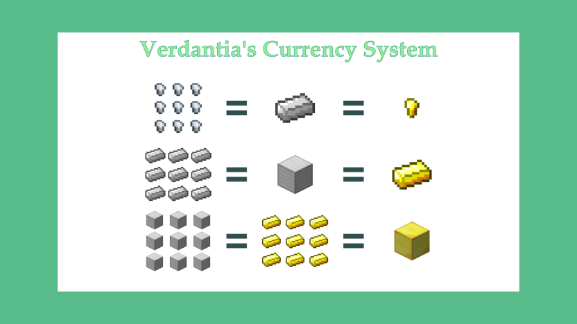

Placeholder

## General Rules

1. **Treat others with respect.**
   If you disagree with someone, discuss the topic with civility or change the subject.
2. **Do not grief player-made structures.**
   Someone worked hard on that building.
3. **Stealing is prohibited unless allowed by the current roleplay scenario.**
   Seek an admin if you are uncertain.
4. **AFK farms are not allowed.**
   If you are logged in just to gather resources, remind yourself that this is primarily a roleplay server.
   There are better uses of your time.
5. **PVP is enabled, but both parties must consent to fighting before taking action.**
   No random killing sprees.
6. **Respect the owner and other staff members.**
   They have the final say in player conflicts.
   If you have doubt, contact another admin or the owner through Discord or in-game chat, and it will be investigated.

## Currency

There is a currency system in place for player and NPC transactions. It is basically `9 iron = 1 gold` ratio (i.e. 9 iron ingots = 1 gold ingot).

## Roleplay Guidelines

1. **Try to stay in-character.**
   We're pretty casual about most things, but do take character interaction seriously.
   You don't need to speak in _Old English_ by any means, but speaking in character is expected of everyone from most interactions.
   If you are speaking out of character, use brackets or parenthesis, such as `(( Can I get a teleport ))` or, `>> You accidentally spawned the boss 4 times`.
2. **Metagaming is prohibited.**
   This one is pretty straightforward.
   If you know something your character couldn't, don't use it in roleplay.
   For example, if you hear someone talk out of character in chat about a treasure, you should not immediately seek said treasure.
   Your character has to learn about something through roleplay interaction in order to take action.
3. **Powergaming is prohibited.**
   Though most combat will attempted to be fairly balanced, your character cannot be invincible.
   Try and be realistic about your strength and energy in combat, and understand that you cannot win every fight or attempt everything alone.
